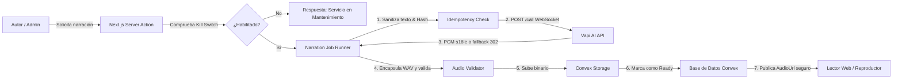

# Guía de Operaciones y Manual de Soporte: Narraciones Vapi AI

**Versión:** 1.0.0  
**Fecha de Entrada en Vigor:** 2026-08-29  
**Audiencia:** Operadores de Infraestructura, Desarrolladores de Guardia (SRE), Administradores de Blog y Soporte Técnico.

---

## 1. Resumen y Arquitectura Operativa

El sistema de narraciones sintetiza artículos de blog en archivos de voz continuos mediante la orquestación segura con la API de Vapi y la persistencia física en **Convex Storage**.



---

## 2. Kill Switch y Feature Flags Globales

### 2.1. Activación Inmediata del Kill Switch (Sin Redespliegue)

Si se detecta un incidente en el proveedor Vapi, consumo anómalo de cuota o corrupción de datos, un operador puede deshabilitar la generación de narraciones y el reproductor de forma global e inmediata.

#### Pasos para Vercel / Entorno de Producción:
1. Ir a **Vercel Dashboard** → Proyecto `your-blog` → **Settings** → **Environment Variables**.
2. Crear o actualizar la variable:
   ```bash
   AUDIO_NARRATION_KILL_SWITCH=true
   ```
3. Guardar cambios. La configuración surte efecto en tiempo de ejecución para generación **y** para el reproductor público (`getPostForReading` no adjunta narración). Para ocultar el player en el bundle del cliente, establecer también `NEXT_PUBLIC_AUDIO_NARRATION_KILL_SWITCH=true`.

#### Pasos en Convex Dashboard (si aplica):
1. Ir a **Convex Dashboard** → **Settings** → **Environment Variables**.
2. Verificar que las mutaciones no ejecuten llamadas de subida mientras el kill switch esté activo.

### 2.2. Reanudación del Servicio tras Incidencia:
1. Establecer `AUDIO_NARRATION_KILL_SWITCH=false` o eliminar la variable de entorno.
2. Comprobar el log de salud mediante la ejecución de la suite de contratos:
   ```bash
   pnpm test:narration:faults
   ```

---

## 3. Matriz de Diagnóstico y Resolución de Incidencias

| Código / Síntoma | Causa Raíz Probable | Impacto | Acción Operativa Inmediata |
|---|---|---|---|
| **`AUTH_ERROR` (HTTP 401 / Unauthorized)** | La variable `VAPI_PRIVATE_API_KEY` es incorrecta, fue revocada o expiró en el dashboard de Vapi. | No se pueden generar nuevas narraciones; los audios existentes en Convex Storage se siguen reproduciendo con normalidad. | 1. Verificar la clave en el panel de Vapi.<br>2. Actualizar `VAPI_PRIVATE_API_KEY` en Vercel.<br>3. Reintentar job fallido desde el panel del post. |
| **`RATE_LIMIT` (HTTP 429 / Too Many Requests)** | Se superó el límite de concurrencia o de solicitudes por minuto de la cuenta Vapi. | Los jobs en cola fallan con mensaje "Límite alcanzado". | 1. Elevar cuota en Vapi.<br>2. La cola reintentará automáticamente con backoff.<br>3. Si el tráfico es excesivo, activar Kill Switch temporal. |
| **`TIMEOUT` (> 90 segundos)** | El asistente Vapi no completó la lectura o la llamada quedó en estado `in-progress` sin finalizar. | El runner interrumpe defensivamente la petición tras `maxPollWaitMs` (90s). | 1. El runner limpia temporizadores y marca status `failed`.<br>2. Verificar longitud del texto (máximo recomendado: 5.000 palabras por artículo).<br>3. Reintentar con `retryPostNarrationAction`. |
| **`EMPTY_ARTIFACT` (0 bytes)** | El stream WebSocket no produjo PCM o el fallback `/assistant-recording` llegó vacío. | El audio validator rechaza el buffer y evita subir archivos vacíos. | 1. El post permanece 100% inalterado.<br>2. Verificar transporte `vapi.websocket` y que el payload no contenga campos telefónicos. |
| **`INVALID_FORMAT` (Sin Magic Bytes MP3/WAV)** | El proveedor devolvió un payload erróneo (HTML de proxy o error JSON) con cabecera de audio. | El validador rechaza el archivo corrupto. | 1. Revisar logs estructurados en busca de respuestas de proxy 502/504.<br>2. Reintentar la síntesis. |
| **`STORAGE_ERROR` (Fallo en Convex Storage)** | Cuota de almacenamiento de Convex superada o token de subida expirado. | Falla la persistencia del archivo final. | 1. Verificar uso en Convex Dashboard → Storage.<br>2. Purgar narraciones huérfanas si es necesario. |

---

## 4. Monitoreo y Telemetría Estructurada

Cada ejecución del pipeline emite eventos estructurados en JSON con el prefijo `[NARRATION_METRIC:...]`:

### Ejemplo de Log de Éxito:
```json
{
  "postId": "post_xyz_123",
  "tenantId": "user_456",
  "action": "create",
  "status": "success",
  "durationMs": 4250,
  "audioSizeBytes": 450200,
  "audioDurationSec": 135,
  "wordCount": 380,
  "costUsd": 0.042,
  "timestamp": "2026-08-29T18:30:00.000Z"
}
```

### Ejemplo de Log de Fallo Sanitizado:
```json
{
  "postId": "post_xyz_123",
  "action": "retry",
  "status": "failed",
  "durationMs": 90120,
  "errorCategory": "TIMEOUT",
  "errorMessage": "La generación de narración en Vapi superó el tiempo máximo de espera (90 segundos).",
  "timestamp": "2026-08-29T18:35:00.000Z"
}
```

---

## 5. Procedimiento de Verificación Preventiva (Health Check)

Antes de autorizar migraciones de producción o eventos de alto tráfico, ejecutar la suite completa de verificación:

```bash
# 1. Ejecutar verificación de tolerancia a fallos y simulación Vapi
pnpm test:narration:faults

# 2. Ejecutar verificación de seguridad y aislamiento multi-tenant
pnpm test:narration:security

# 3. Ejecutar verificación de accesibilidad del reproductor
pnpm test:narration:a11y

# 4. Ejecutar suite unificada
pnpm test:narration
```
