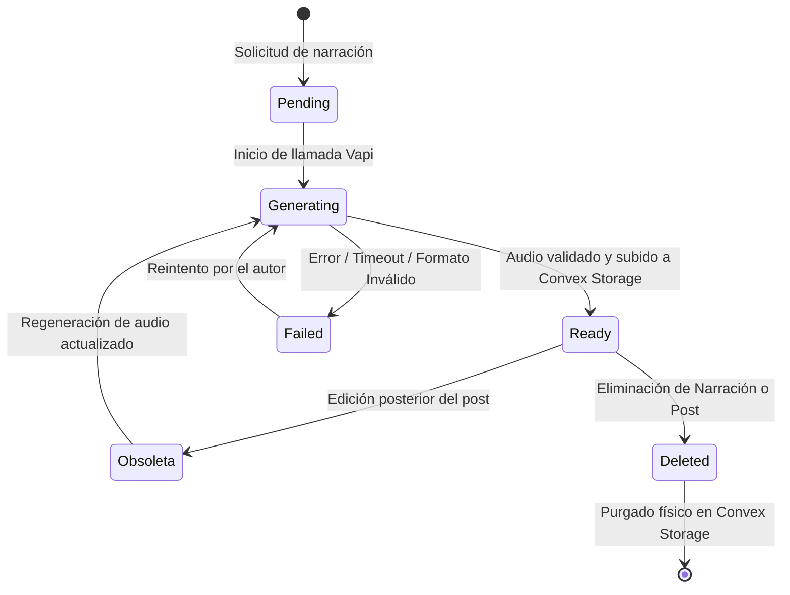

# Política de Privacidad, Tratamiento de Datos y Retención de Audio: Narraciones Vapi AI

**Versión:** 1.0.0  
**Fecha de Entrada en Vigor:** 2026-08-29  
**Ámbito de Aplicación:** Todos los tenants, blogs individuales y organizaciones alojadas en la plataforma.

---

## 1. Principios Fundamentales de Privacidad

La integración de síntesis de voz mediante IA para artículos editoriales opera bajo un principio estricto de **mínima exposición de datos (Privacy by Design)**:

1. **Exclusión Estricta de Información de Identificación Personal (PII):**
   - Nunca se envían direcciones de correo electrónico, números telefónicos, direcciones IP, nombres de usuario de Clerk ni metadatos de sesión a Vapi ni a terceros de voz.
   - Solo se transmite el **guion de voz sanitizado** del artículo (título + contenido editorial aprobado).

2. **Sanitización Previa a la Transmisión (`speech-script-sanitizer`):**
   - Se eliminan etiquetas `<script>`, `<style>`, bloques de código `<pre><code>`, bloques de markdown, URLs no leíbles con tokens/query parameters, y elementos no editoriales (captions de imágenes, figuras).
   - Se procesan exclusivamente las palabras destinadas a lectura prosódica.

3. **Cero Retención en Infraestructura de Terceros:**
   - La sesión de llamada en Vapi se ejecuta como asistente transitorio (sin almacenamiento a largo plazo en Vapi).
   - El archivo binario generado se descarga inmediatamente al almacenamiento soberano de la plataforma (**Convex Storage**) y no depende de URLs de terceros.

---

## 2. Ciclo de Vida y Retención de Archivos de Audio

### 2.1. Reglas de Retención:
- **Narraciones Activas (`status: "ready"`):**
  - Se conservan en Convex Storage mientras el post asociado permanezca publicado o en el panel del autor.
- **Narraciones Fallidas (`status: "failed"`):**
  - No ocupan almacenamiento binario (si hubo subida parcial antes del fallo, el runner ejecuta `storage.delete(storageId)` inmediatamente).
  - El registro de fallo se conserva para diagnóstico del autor hasta que se reintente o elimine.
- **Narraciones Obsoletas (`isOutdated: true`):**
  - Cuando el autor edita el contenido del artículo, el hash previo (`contentHash`) se marca como desactualizado.
  - El audio anterior se mantiene reproducible hasta que el autor decida expresamente regenerar la narración para el nuevo texto.

---

## 3. Política de Purga Física y Borrado en Cascada

Cuando un autor o administrador ejecuta la eliminación de un artículo o de su narración asociada:

1. **Purga Inmediata en Convex Storage:**
   - La mutación `api.narrations.remove` ejecuta `ctx.storage.delete(narration.storageId)`.
   - El archivo binario (MP3/WAV) se elimina físicamente de la infraestructura de almacenamiento, revocando cualquier enlace de descarga previo.

2. **Eliminación en Cascada:**
   - Si se elimina un post mediante `postRepository.delete`, todas las narraciones asociadas son desvinculadas y sus archivos binarios purgados de forma atómica.

3. **Garantía de Immutabilidad del Post:**
   - Ninguna operación de narración (éxito, fallo o borrado) modifica el post editorial (título, contenido, `publishedAt`, contador de likes ni vistas).

---

## 4. Matriz de Tratamiento de Datos

| Dato | Destino | Propósito | Cifrado / Seguridad |
|---|---|---|---|
| **Texto del artículo (sanitizado)** | Vapi AI (OpenAI / 11Labs) | Síntesis de voz editorial | Cifrado en tránsito (TLS 1.3). No se utiliza para entrenamiento de modelos base. |
| **Clave Privada Vapi (`VAPI_PRIVATE_API_KEY`)** | Servidor Node.js (Servidor interno) | Autenticación del pipeline | Variable de entorno de servidor. Nunca expuesta al cliente ni a logs. |
| **Archivo Binario de Audio (MP3/WAV)** | Convex Storage | Alojamiento soberano del podcast / audiolibro | URLs firmadas / CDN público seguro solo para `status: "ready"`. |
| **Identificadores de Llamada (`vapiCallId`)** | Base de Datos Convex (Colección `postNarrations`) | Trazabilidad y resolución de disputas de coste | Visible exclusivamente para el autor/admin propietario; oculto a lectores anónimos. |
| **Metadatos de Telemetría** | Buffer de métricas en memoria del servidor | Monitoreo de latencia y tasa de fallo | Logs estructurados sin tokens ni datos personales. |
