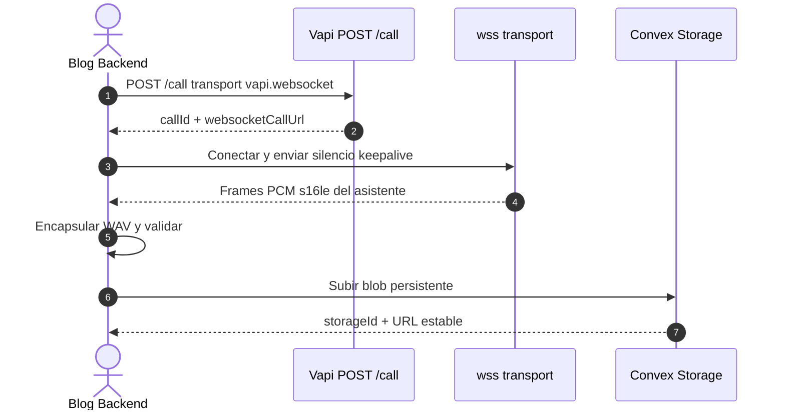

# Evaluación Técnica y Spike Reproducible: Generación de Narraciones con Vapi

**Fecha:** 2026-08-29  
**Actualizado:** 2026-08-29  
**Estado:** GO para Vapi WebSocket headless / NO-GO para `POST /call/web` (Daily.co) y telefonía  
**Objetivo:** Confirmar un camino reproducible para generar audio de narración sin llamadas telefónicas, sin participante humano en el navegador y sin exponer claves ni artefactos privados.

---

## 1. Resumen Ejecutivo

Vapi es una plataforma de agentes de voz. `POST /call/web` abre una sala WebRTC (Daily.co) y **no sintetiza audio** si no hay un cliente conectado (`customer-did-not-answer` / `assistant-join-timed-out`).

La decisión de producto es **seguir con Vapi** (no ElevenLabs ni OpenAI TTS). El camino aprobado es:

1. `POST https://api.vapi.ai/call` con `transport.provider: "vapi.websocket"`.
2. El servidor se conecta a `transport.websocketCallUrl`.
3. El asistente narra `firstMessage` (guion sanitizado).
4. El backend captura PCM `s16le`, lo encapsula en WAV y lo guarda en **Convex File Storage**.
5. Fallback: `GET /call/{id}/assistant-recording` (302 autenticado, solo servidor).

Telefonía (`phoneNumberId`, `customer`, PSTN/SIP) está prohibida.

---

## 2. Matriz de Decisión Go / No-Go

| Criterio | Requerimiento | `/call/web` (Daily.co) | WebSocket `vapi.websocket` |
| :--- | :--- | :--- | :--- |
| **Generación headless** | Audio sin navegador ni oyente humano | NO-GO | **GO** |
| **Aislamiento telefónico** | 0 PSTN/SIP | CUMPLIDO | **CUMPLIDO** |
| **Formato web** | WAV/MP3 reproducible | Condicional | **WAV desde PCM; MP3 vía fallback** |
| **Credenciales** | Clave solo en servidor | CUMPLIDO | **CUMPLIDO** |
| **URL pública** | Storage propio, no 302 de Vapi | Requiere proxy | **Convex Storage** |

---

## 3. Arquitectura aprobada



### Endpoints oficiales

* `POST https://api.vapi.ai/call` + `transport.provider: "vapi.websocket"` — [WebSocket Transport](https://docs.vapi.ai/calls/websocket-transport)
* `GET https://api.vapi.ai/call/{id}`
* `GET https://api.vapi.ai/call/{id}/assistant-recording` — fallback 302 autenticado

`POST /call/web` queda documentado como **ruta rechazada**.

---

## 4. Seguridad

1. `VAPI_PRIVATE_API_KEY` solo en servidor (sin `NEXT_PUBLIC_`).
2. Las URLs 302 de Vapi nunca se persisten ni se envían al navegador.
3. El reproductor público solo recibe `audioUrl` de Convex Storage y el transcript si `status === "ready"`.

---

## 5. Suite reproducible

```bash
pnpm test:vapi-spike --dry-run
pnpm test:vapi-spike
pnpm test:narration
```

El dry-run valida el contrato WebSocket (cero telefonía, `artifactPlan`, transporte). La ejecución en vivo requiere `VAPI_PRIVATE_API_KEY`.

---

## 6. Documentación relacionada

- [vapi-narration-operations-guide.md](./vapi-narration-operations-guide.md)
- [vapi-narration-privacy-and-retention-policy.md](./vapi-narration-privacy-and-retention-policy.md)
- `scratch/vapi-narration-poc.ts`
- `scratch/test-vapi-narration-fault-injection.ts`
